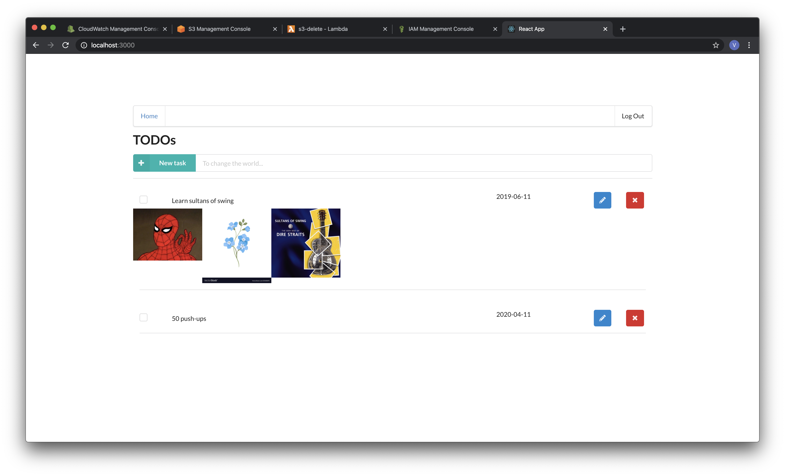

# Serverless TODO

A simple TODO application using AWS Lambda and Serverless framework.

- AWS API id: `n5fqote8nf`
- Auth0 
  - domain: `direvin.auth0.com`
  - clientId: `Ej7BYYwRJN9nExKU61fX689FH1W5qkr2`

# Functionality of the application

- This application will allow creating/removing/updating/fetching TODO items. Each TODO item can optionally have an attachment image. Each user only has access to TODO items that he/she has created.
- Each TODO can have multiple attachments
- If a TODO is deleted, related attachments are deleted from S3, by a lambda function which is triggered by DynamoDB stream

## Sample screenshot


# How to run the application

```
cd client
npm install
npm run start
```

This should start a development server with the React application that will interact with the serverless TODO application.
